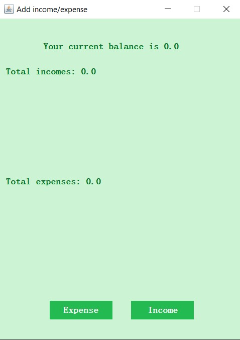
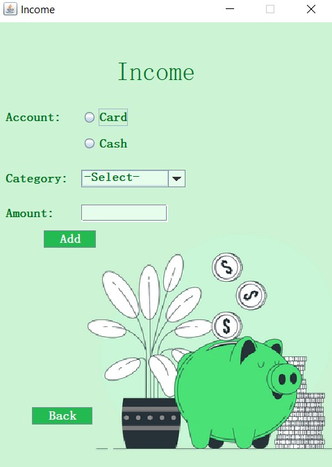
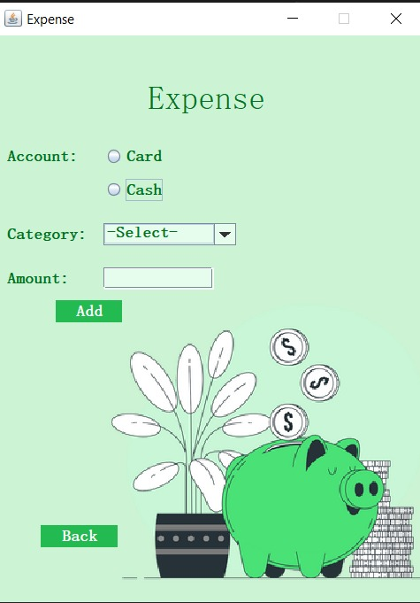

# MoneyManagerApplication
Proiect final POO

La rularea aplicatiei utilizatorul va fi redirectionat catre o fereastra de login.

Se va creea un fisier logging de tip Singleton care va nota diferite informatii intr-un fisier in timpul rularii aplicatiei.
Campurile de user si password nu au restrictii privind numarul de caractere, tipul de caractere introduse. Singura conditie pentru ca logarea sa aiba loc cu succes este aceea de a nu lasa campurile sau unul din campuri gol.

Fereasta Income contine doua RadioButtons, unul de Cash iar celelat de Card pentru a selecta forma de plata.
Urmatorul pas este de a selecta o categorie, pentru a realiza acest lucru am folosit Dropdown. 

Utilizatorul va introduce suma incasata/cheltuita intr-un TextField. 
Inainte ca aceasta sa fie confirmata, in aplicatie se produc verificari cum ar fi:
-Sa nu fie  TextFieldul gol
-Sa nu fie introduse litere in loc de cifre

Ferestrele Income si Expense au aceleasi functionalitati, singura diferenta este ca fiecare are propriile categorii.
La aceste ferestere a fost implementat un buton Back care redirectioneaza utilizatorul catre fereastra de Choice.
Am folosit JOptionPane pentru a creea un pop-up in cazul in care apar diferite avertizari sau pentru a informa utilizatorul ca operiatiunea a fost incheiata cu succes.
Este permisa selectarea unei singure optiuni.

